# Creating a User

### Login to AWS Console: https://console.aws.amazon.com/

### Go to IAM
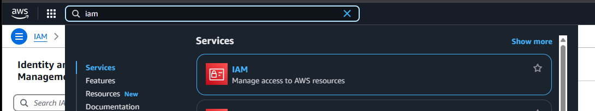

### Click on Users
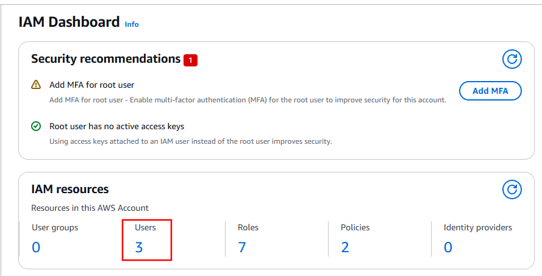

### Click on Create user
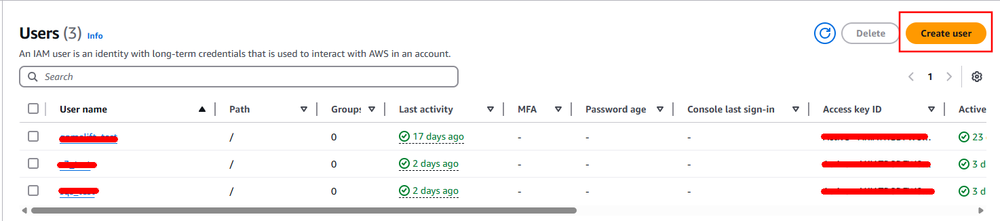

## Give your user a name
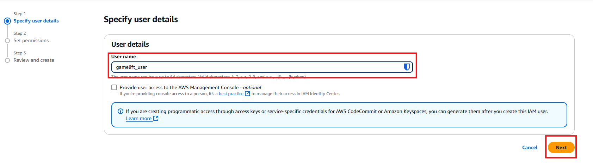

## Select "Attach policies directly"
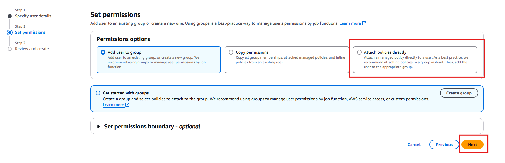

## Review the user and click on Create user 
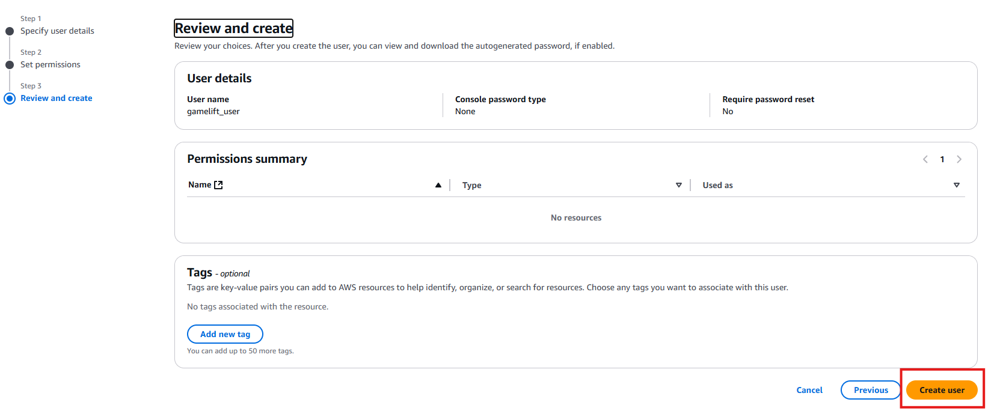

## Click on the user we just created
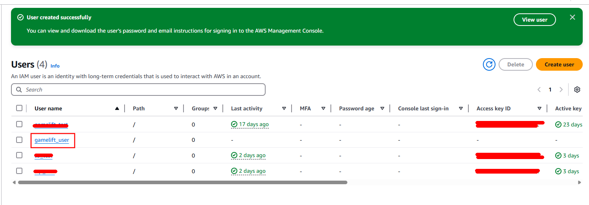

## Click on "Add permissions" and "Create inline policy"
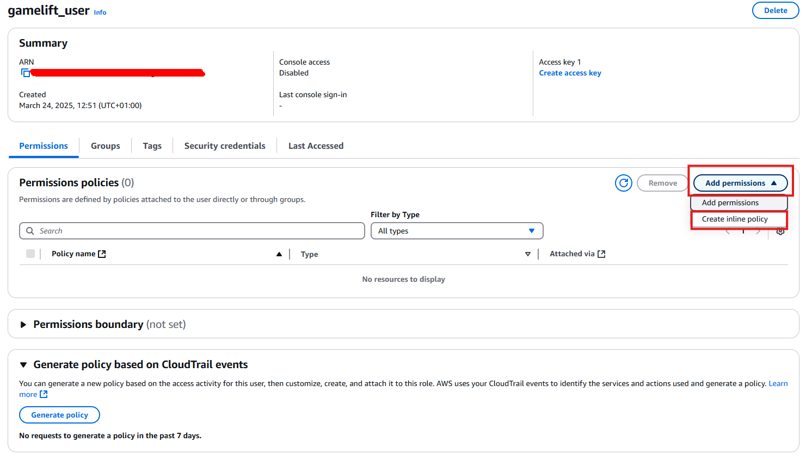

## Search for the service you want to add, ie gamelift
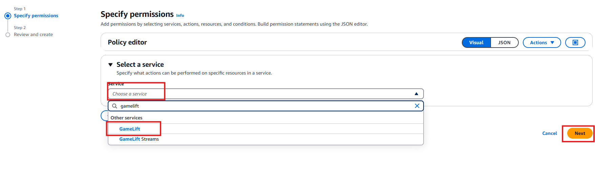

## Select all permissions and Allow
:::danger
In this example we're granting ALL permissions to the gamelift user and the gamelift service, this is not recommended for a release build of your product, for better security select only the permissions that is required for your particular case. **This is for demonstration purposes only!**
:::
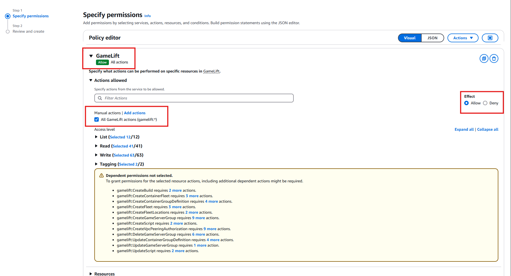

## Select "All" resources and click on Next
:::danger
In this example we're granting ALL permissions to the gamelift user and the gamelift service, this is not recommended for a release build of your product, for better security select only the permissions that is required for your particular case. **This is for demonstration purposes only!**
:::
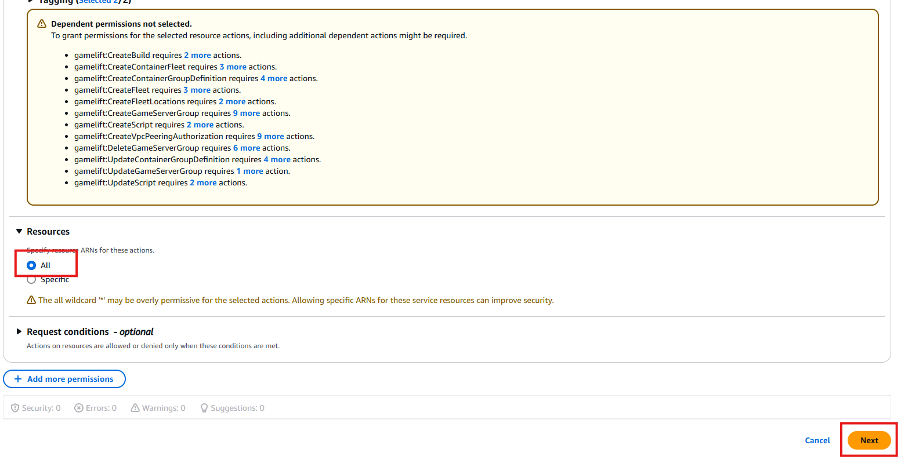

## Review and create
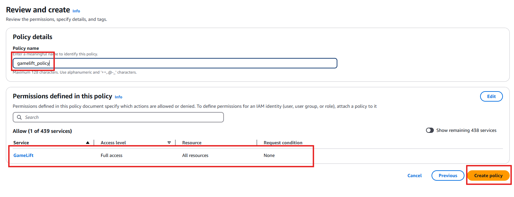

## Click on Security Credentials
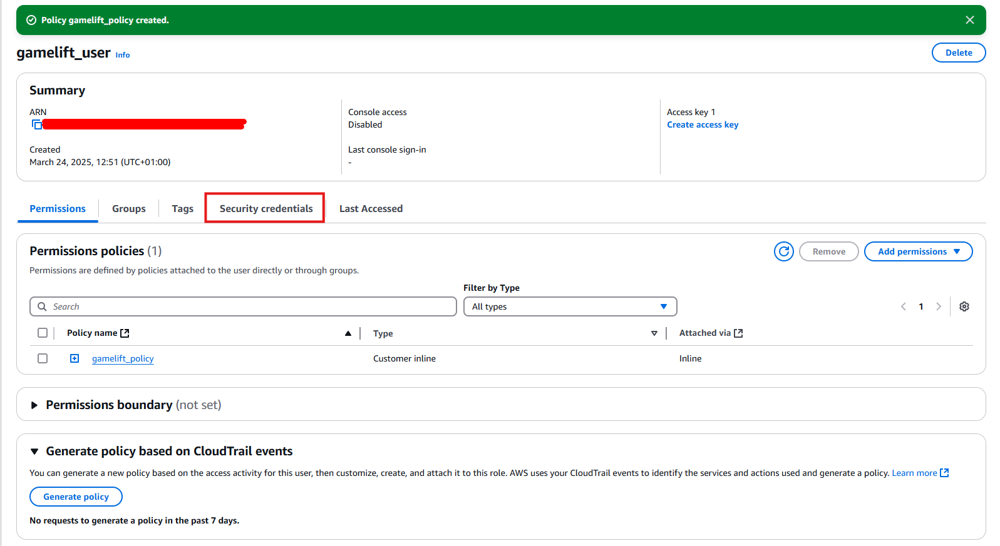

## Create an access key
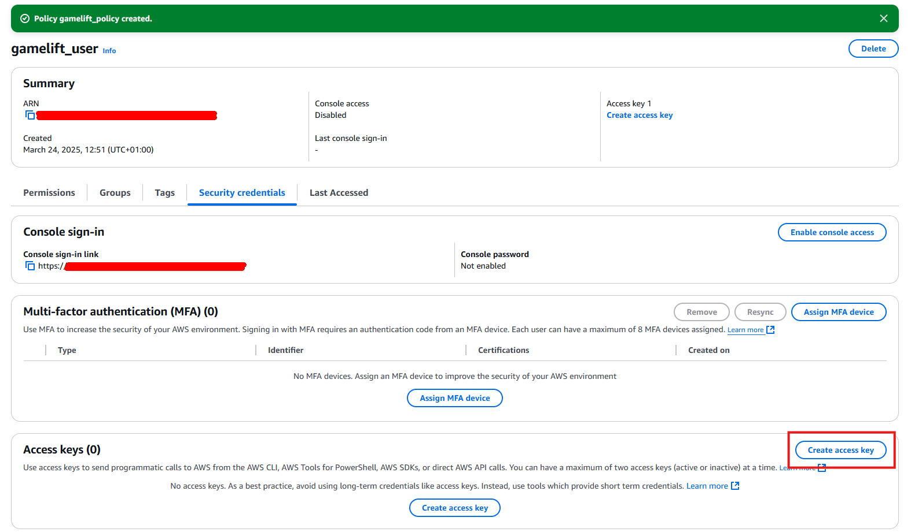

## Make sure you read and understand the consequences of access keys
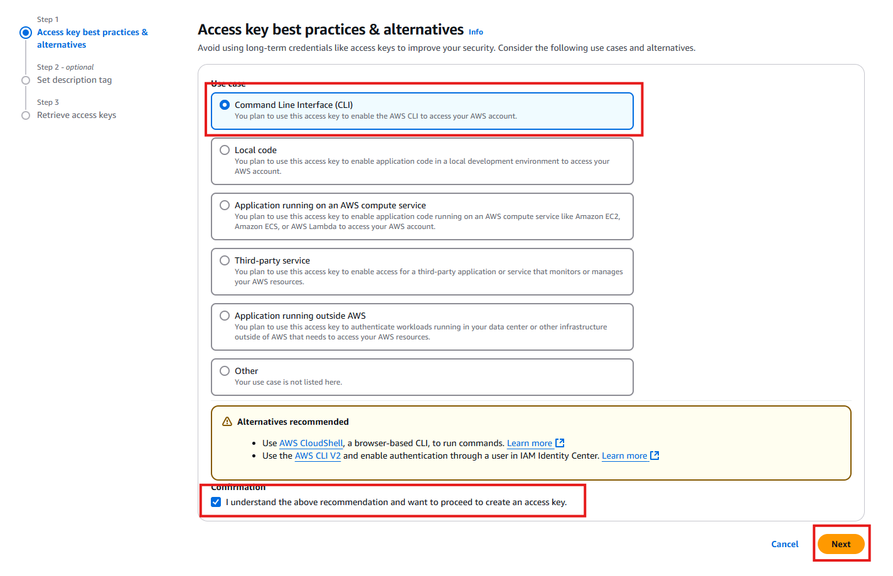

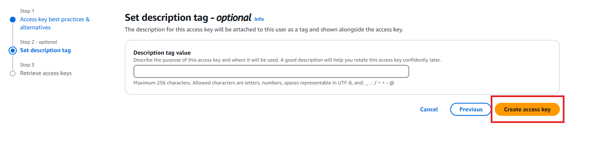

## Make sure you save the keys by downloading the .cvs file
- These values will be used when initializing the aws plugin

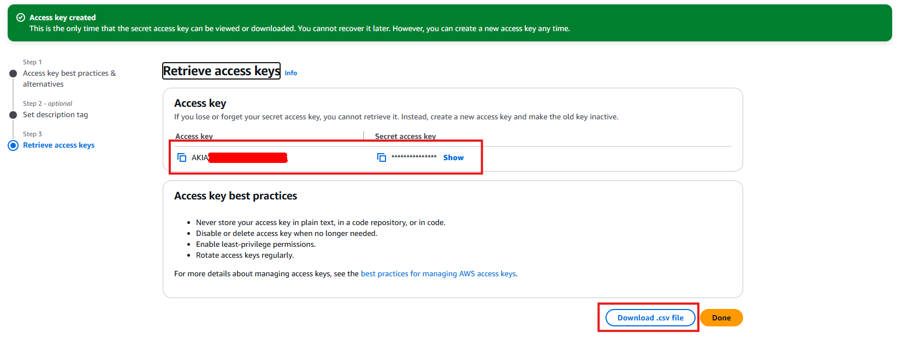