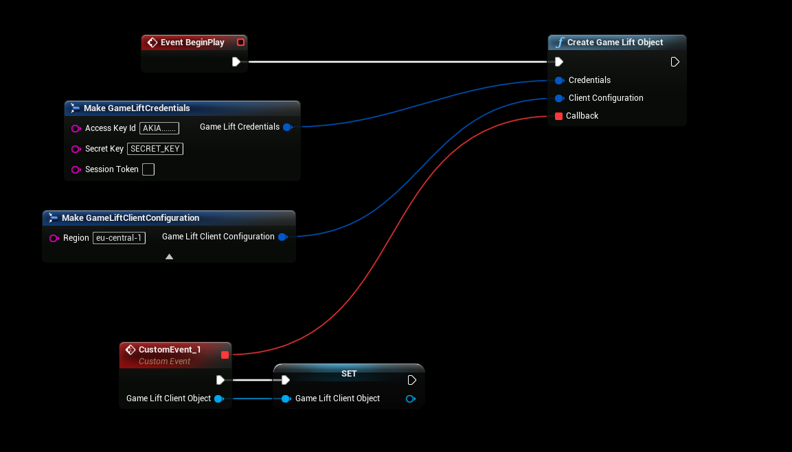

# Initializing the Plugin
* [If you haven't already created a gamelift IAM user, start here.](./creating_user.md)
* We're going to use the credentails / access key that was created in the "Creating a User" doc

## Initializing
- Use the credentials created in the [previous step](./creating_user.md)
- Make sure you select the correct region that you are working on, in this case it's "**eu-central-1**"

## Using the plugin
- After initilizing the plugin you can start [using the plugin](./using_plugin.md)