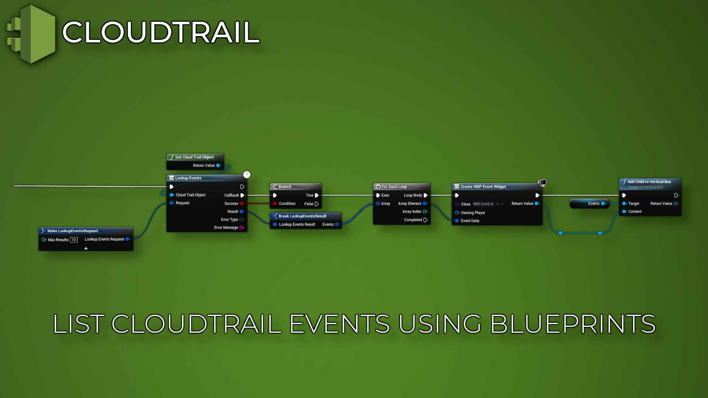

import Tabs from '@theme/Tabs';
import TabItem from '@theme/TabItem';

# Introduction

## Features
- This plugin enables you to use Amazon Cloudtrail Services inside Unreal Engine!
- With CloudTrail, you can log, continuously monitor, and retain account activity related to actions across your AWS infrastructure.

<Tabs>
  <TabItem value="image" label="Image" default>
    
  </TabItem>
  <TabItem value="image2" label="Image 2">
    
  </TabItem>
</Tabs>

## Purchase
- https://www.fab.com/listings/69b612a1-3431-4308-a590-e0a2aafaf378

# AWS (Amazon) Documentation
- https://aws.amazon.com/cloudtrail/