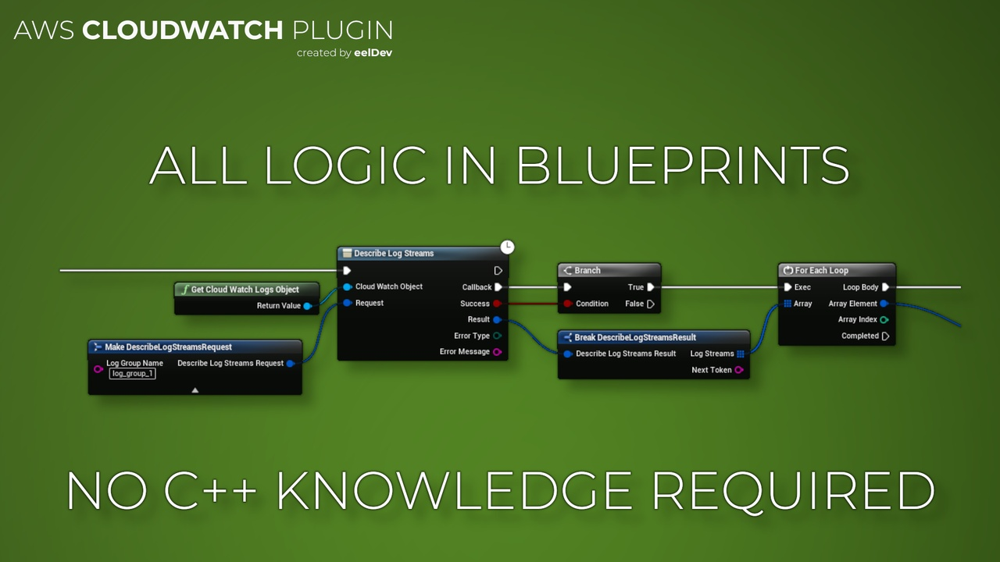

# Introduction

import Tabs from '@theme/Tabs';
import TabItem from '@theme/TabItem';

## Features
- This plugin enables you to use Amazon CloudWatch Services inside Unreal Engine Blueprints!
- Amazon CloudWatch enables you to publish, monitor, and manage various metrics, as well as configure alarm actions based on data from metrics. This guide provides detailed information about CloudWatch actions, data types, parameters, and errors
- Amazon CloudWatch Logs enables you to monitor, store, and access your system, application, and custom log files. This guide provides detailed information about CloudWatch Logs actions, data types, parameters, and errors. For more information about CloudWatch Logs features, see the [Amazon CloudWatch Logs User Guide](https://docs.aws.amazon.com/AmazonCloudWatch/latest/logs/)

<Tabs>
  <TabItem value="image" label="Image" default>
    
  </TabItem>
</Tabs>

## Purchase
- https://www.fab.com/listings/2c58c6f6-0ec4-436b-a5e4-6a61e61c47ed

# AWS (Amazon) Documentation
- https://aws.amazon.com/cloudwatch/

## Additional Links
- [Read more about Amazon CloudWatch here](https://docs.aws.amazon.com/AmazonCloudWatch/latest/APIReference/Welcome.html)
- [Read more about Amazon CloudWatch Logs here](https://docs.aws.amazon.com/AmazonCloudWatchLogs/latest/APIReference/Welcome.html)