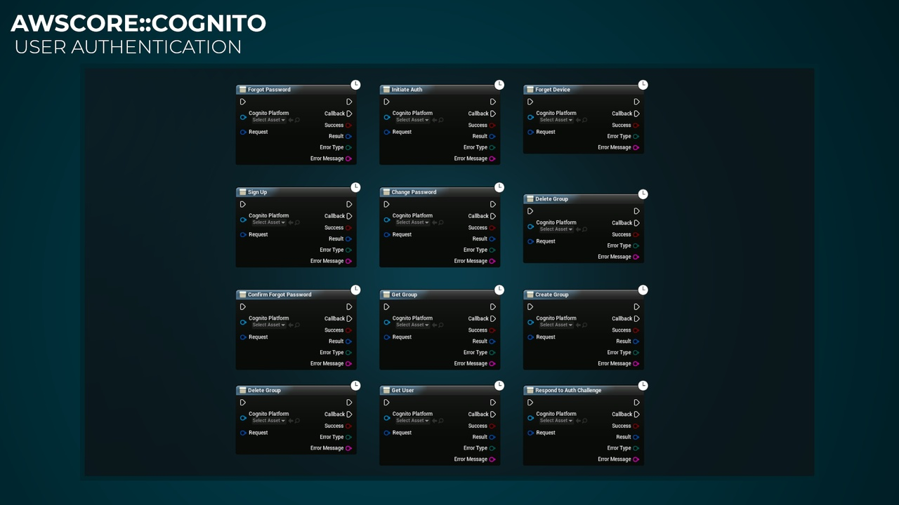

import Tabs from '@theme/Tabs';
import TabItem from '@theme/TabItem';

# Introduction

## Features
- This plugin gives you the ability to communicate with AMAZON WEB SERVICES Cognito inside Unreal Engine.
- Amazon Cognito lets you add user sign-up, sign-in, and access control to your web and mobile apps quickly and easily. Amazon Cognito scales to millions of users and supports sign-in with social identity providers, such as Facebook, Google, and Amazon, and enterprise identity providers via SAML 2.0.

<Tabs>
  <TabItem value="image" label="Image" default>
    
  </TabItem>
  <TabItem value="image2" label="Image 2">
    
  </TabItem>
  <TabItem value="image3" label="Image 3">
    
  </TabItem>
</Tabs>

## Purchase
- https://www.fab.com/listings/f1f448f1-0d7b-4f78-81ea-7b28ea518328

# AWS (Amazon) Documentation
- https://docs.aws.amazon.com/cognito-user-identity-pools/latest/APIReference/Welcome.html