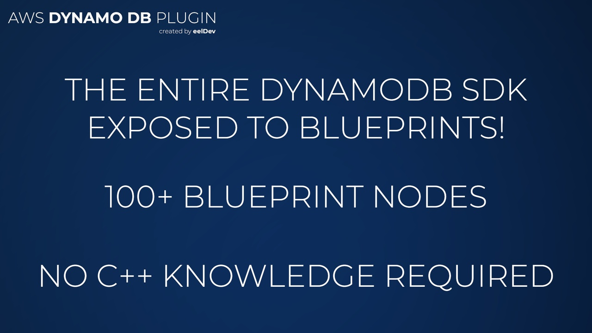
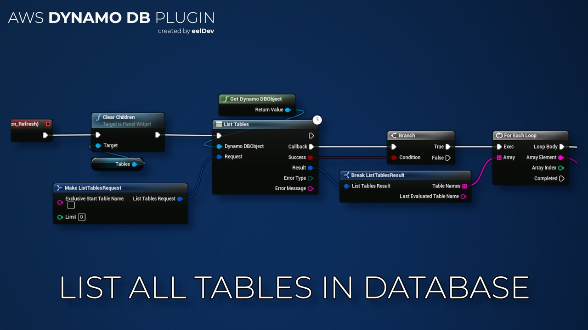

import Tabs from '@theme/Tabs';
import TabItem from '@theme/TabItem';

# Introduction

## Features
- This plugin enables you to execute Amazon DynamoDB queries inside Unreal Engine.
- Amazon DynamoDB is a key-value and document database that delivers single-digit millisecond performance at any scale. It’s a fully managed, multiregion, multimaster, durable database with built-in security, backup and restore, and in-memory caching for internet-scale applications. DynamoDB can handle more than 10 trillion requests per day and can support peaks of more than 20 million requests per second.

<Tabs>
  <TabItem value="image" label="Image" default>
    
  </TabItem>
  <TabItem value="image2" label="Image 2">
    
  </TabItem>
  <TabItem value="image3" label="Image 3">
    
  </TabItem>
</Tabs>

## Purchase
- https://www.fab.com/listings/504ddb39-2b89-4b5c-aeb1-ae1e9b2afd66

# AWS (Amazon) Documentation
- https://docs.aws.amazon.com/amazondynamodb/latest/APIReference/Welcome.html