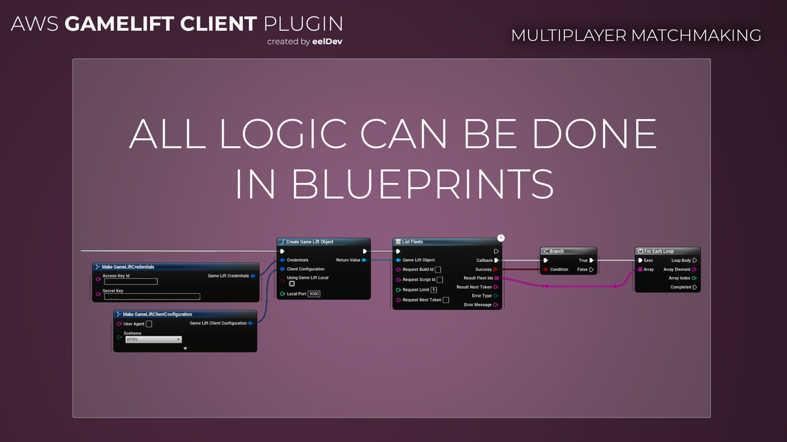
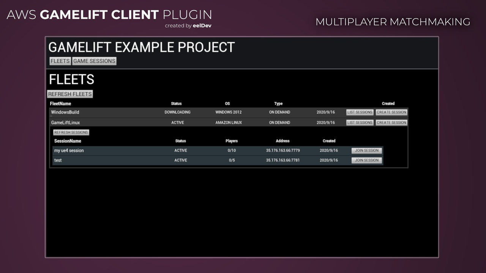
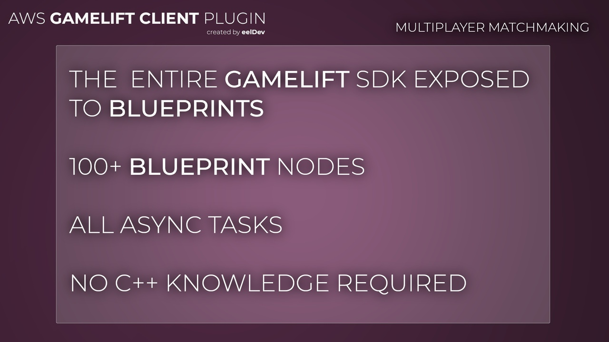

import Tabs from '@theme/Tabs';
import TabItem from '@theme/TabItem';

# Introduction

## Features
- Use AWS Amazon GameLift in Unreal Engine

## What is the difference between the Server plugin and the Client plugin?
- The Server plugin will be running on your dedicated server instance and is used to communicate with the AWS GameLift Service. It will listen and recieve commands from the gamelift service when it's time to shut down, etc.
- The Client plugin is used for GameLift Matchmaking features, it's used by game clients to request matchmaking functionality from GameLift and to tell gamelift if new servers need to be allocated, etc.

## Do I need both Server and Client plugins?
- As described above you may only need one the plugins depending on your needs, if you're going to manually managing your gamelift server instances you only need the Server Plugin (if you're not going to use GameLift matchmaking features etc)
- Both Client and Server plugins are required if you're going to use GameLift Anywhere (this is a new functionality that enables you to host gamelift servers on your own home server).

<Tabs>
  <TabItem value="image" label="Image" default>
    
  </TabItem>
  <TabItem value="image2" label="Image 2">
    
  </TabItem>
  <TabItem value="image3" label="Image 3">
    
  </TabItem>
</Tabs>

## Purchase
- https://www.fab.com/listings/44f68159-2c76-47f0-947f-86a980a0b410

# AWS (Amazon) Documentation
- https://docs.aws.amazon.com/sns/latest/api/Welcome.html