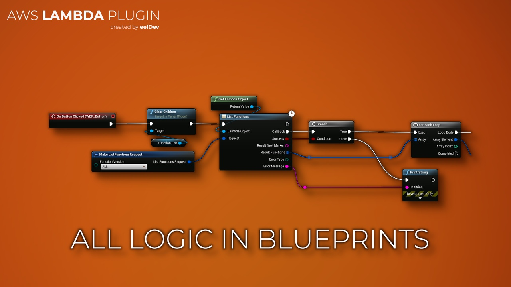
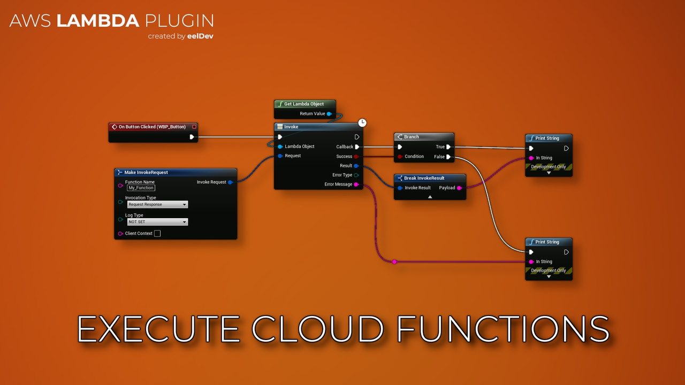
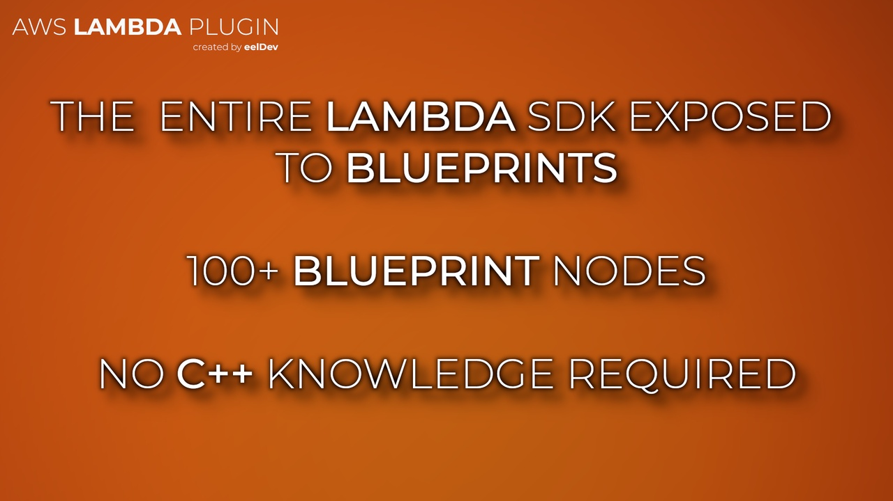

import Tabs from '@theme/Tabs';
import TabItem from '@theme/TabItem';

# Introduction

## Features
- This plugin enables you to execute Amazon Lambda queries inside Unreal Engine.
- AWS Lambda is a compute service that lets you run code without provisioning or managing servers. AWS Lambda executes your code only when needed and scales automatically, from a few requests per day to thousands per second. You pay only for the compute time you consume – there is no charge when your code is not running. With AWS Lambda, you can run code for virtually any type of application or backend service – all with zero administration.
- You can also build serverless applications composed of functions that are triggered by events and automatically deploy them using CodePipeline and AWS CodeBuild. For more information, see [AWS Lambda applications](https://docs.aws.amazon.com/lambda/latest/dg/deploying-lambda-apps.html).

<Tabs>
  <TabItem value="image" label="Image" default>
    
  </TabItem>
  <TabItem value="image2" label="Image 2">
    
  </TabItem>
  <TabItem value="image3" label="Image 3">
    
  </TabItem>
</Tabs>

## Purchase
- https://www.fab.com/listings/d9094934-209f-4c4c-85e1-955c66f1132f

# AWS (Amazon) Documentation
- https://docs.aws.amazon.com/lambda/latest/dg/welcome.html