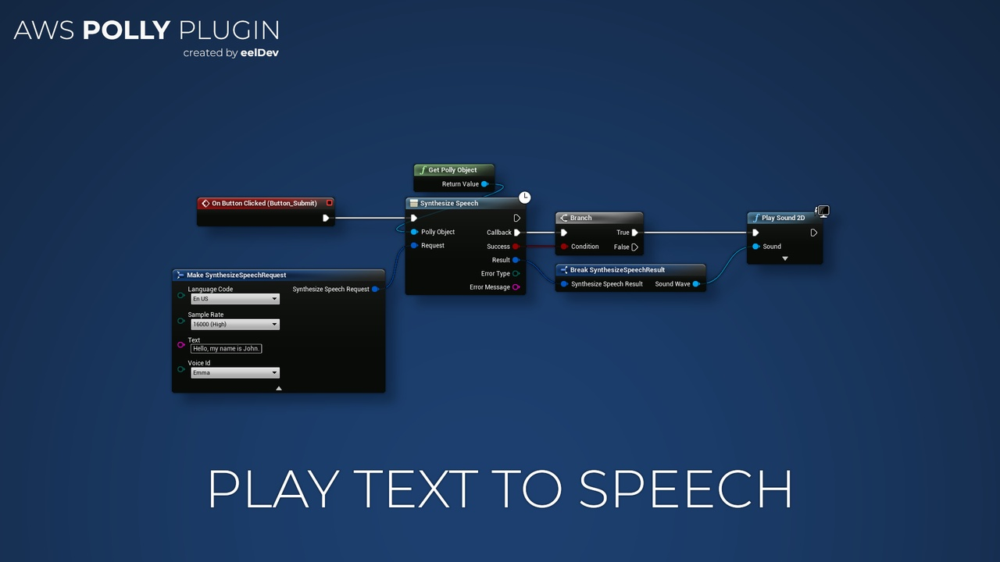

import Tabs from '@theme/Tabs';
import TabItem from '@theme/TabItem';

# Introduction

## Features
- This plugin enables you to execute Amazon Polly inside Unreal Engine.
- Amazon Polly is a service that turns text into lifelike speech, allowing you to create applications that talk, and build entirely new categories of speech-enabled products.

<Tabs>
  <TabItem value="image" label="Image" default>
    
  </TabItem>
  <TabItem value="image2" label="Image 2">
    
  </TabItem>
  <TabItem value="image3" label="Image 3">
    
  </TabItem>
</Tabs>

## Purchase
- https://www.fab.com/listings/776e973a-f20c-4530-a31e-c53bd0337b40

# AWS (Amazon) Documentation
- https://aws.amazon.com/polly/