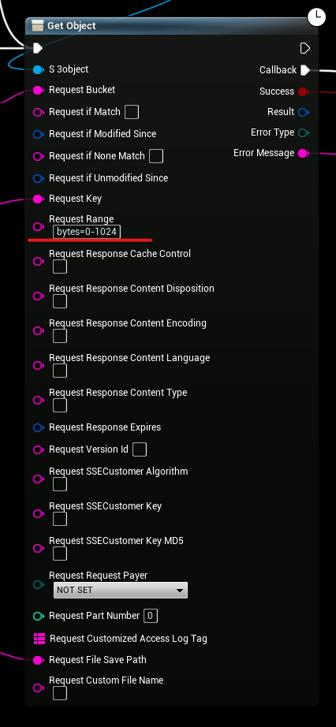
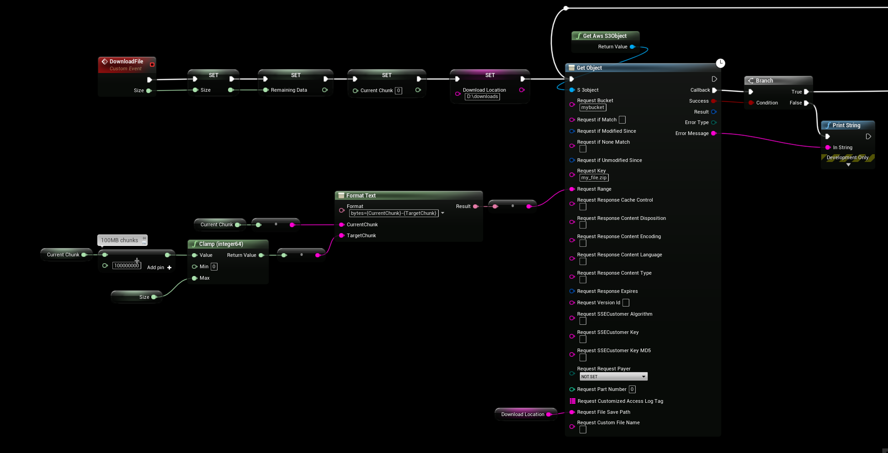
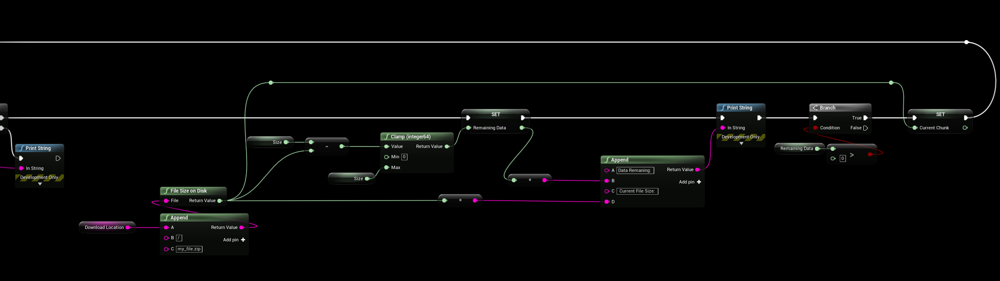

# Downloading Large Files

## Downloading Large Files
:::note
This requires S3 1.3.2, it will not work in previous plugin versions!
:::

- To download large files (100mb or greater) it’s a good idea to split up the downloads into smaller chunks as downloads are loaded into memory before writing to disk, it’ll also allow you to resume downloads and get download progress.

- To download specific bytes of a file we specify “bytes=from-to” and S3 will download the first 1024 bytes of a file.

### Example 
- This is a working example where we download 100MB “chunks” (100000000 bytes) of the .zip file “my_file.zip“, the file will be saved to d:\downloads\my_file.zip

- On callback the async function will write to disk and check the current file size, if there is data remining to download we will loop back and run the GetObject function again to continue downloading from where we left off (in this case we just donwloaded 0-100MB and the next will be 100-200MB)

