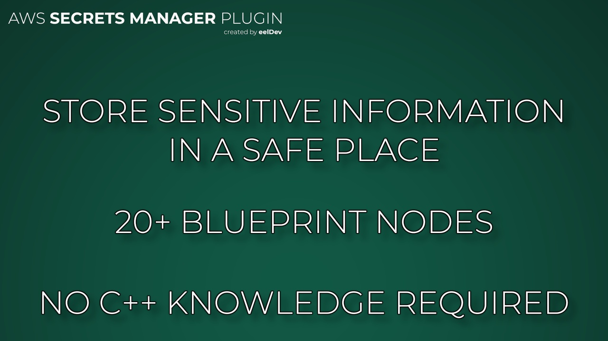
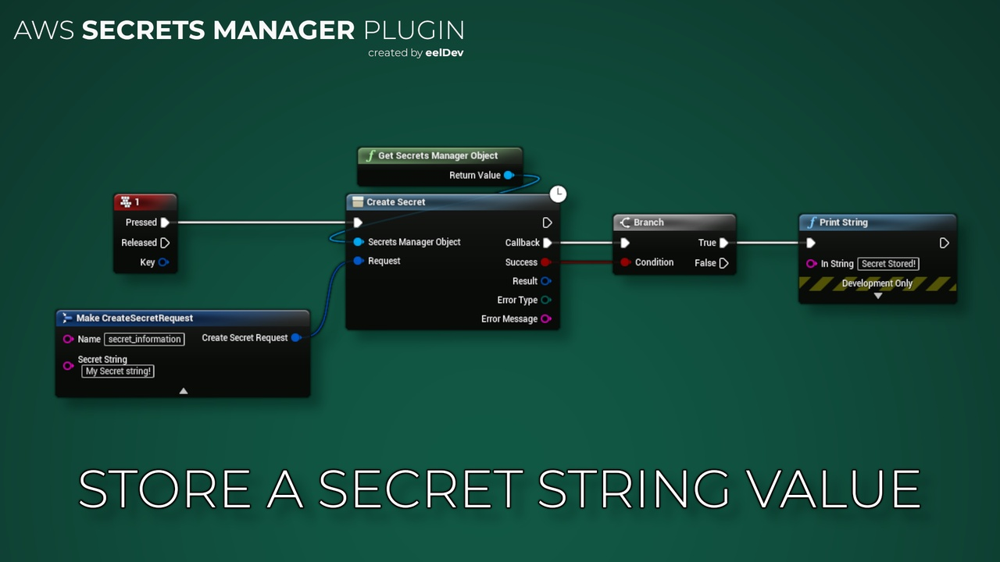
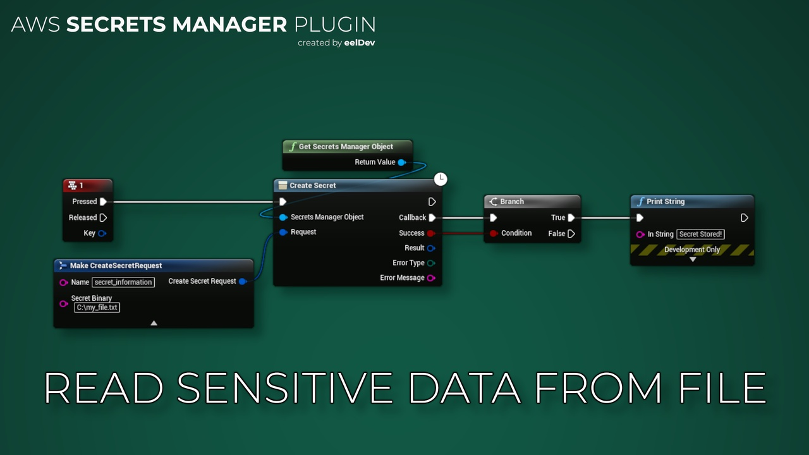
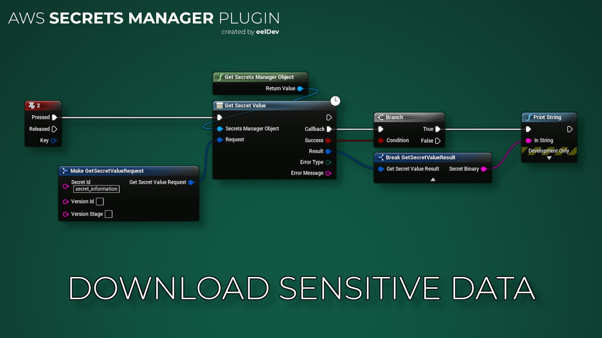

import Tabs from '@theme/Tabs';
import TabItem from '@theme/TabItem';

# Introduction

## Features
- This plugin enables you to execute Amazon Secrets Manager inside Unreal Engine.
- AWS Secrets Manager helps you protect secrets needed to access your applications, services, and IT resources. The service enables you to easily rotate, manage, and retrieve database credentials, API keys, and other secrets throughout their lifecycle

<Tabs>
  <TabItem value="image" label="Image" default>
    
  </TabItem>
  <TabItem value="image2" label="Image 2">
    
  </TabItem>
  <TabItem value="image3" label="Image 3">
    
  </TabItem>
  <TabItem value="image4" label="Image 4">
    
  </TabItem>
</Tabs>

## Purchase
- https://www.fab.com/listings/7949e16c-4be6-4ab9-9be5-fcd9a4bade7e

# AWS (Amazon) Documentation
- https://aws.amazon.com/secrets-manager/