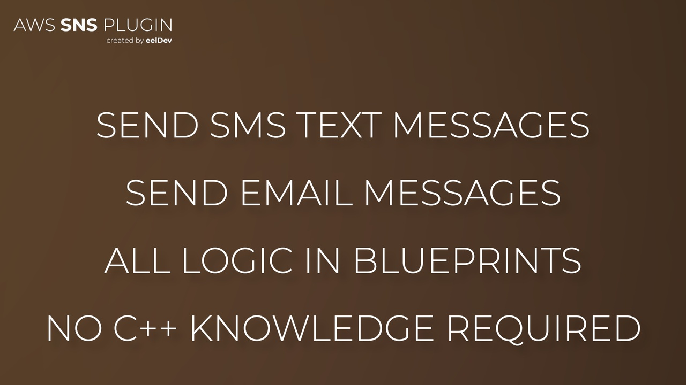
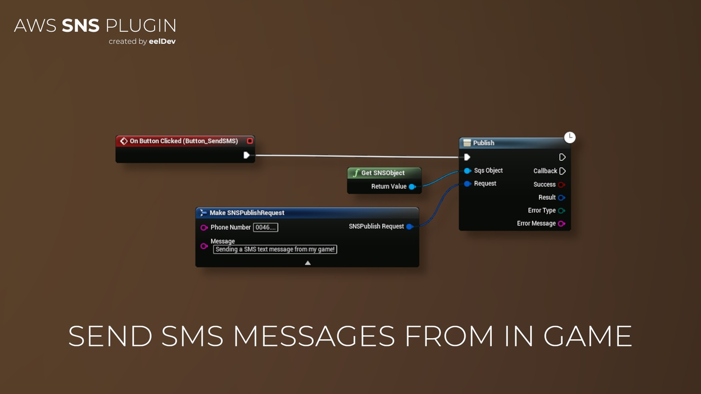

import Tabs from '@theme/Tabs';
import TabItem from '@theme/TabItem';

# Introduction

## Features
- This plugin gives you the ability to communicate with AWS SNS inside Unreal Engine.
- Amazon SNS is a highly available, durable, secure, fully managed pub/sub messaging service that enables you to decouple microservices, distributed systems, and event-driven serverless applications. Amazon SNS provides topics for high-throughput, push-based, many-to-many messaging.

<Tabs>
  <TabItem value="image" label="Image" default>
    
  </TabItem>
  <TabItem value="image2" label="Image 2">
    
  </TabItem>
</Tabs>

## Purchase
- https://www.fab.com/listings/bb31be94-fc43-4b50-b7bd-e3f75480eb2c

# AWS (Amazon) Documentation
- https://docs.aws.amazon.com/sns/latest/api/Welcome.html