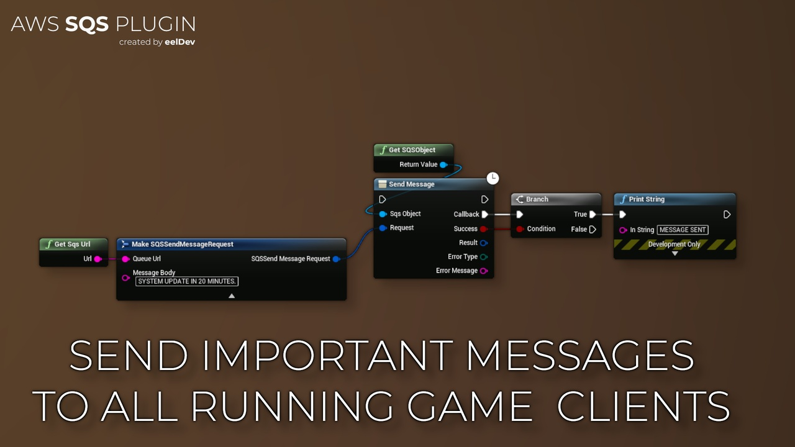
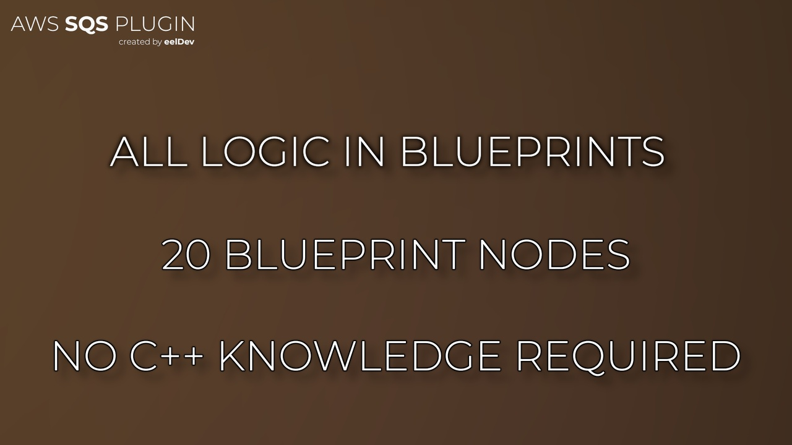

import Tabs from '@theme/Tabs';
import TabItem from '@theme/TabItem';

# Introduction

## Features
- Use Amazon SQS Inside Unreal Engine
- Broadcast messages to all your users / players
- Send text messages to mobile phones
- Send SMS messages

<Tabs>
  <TabItem value="image" label="Image" default>
    
  </TabItem>
  <TabItem value="image2" label="Image 2">
    
  </TabItem>
</Tabs>

## Purchase
- https://www.fab.com/listings/a4972b34-09c9-4bcc-8d10-bc9c8c17df5b

# AWS (Amazon) Documentation
- https://docs.aws.amazon.com/sns/latest/api/Welcome.html