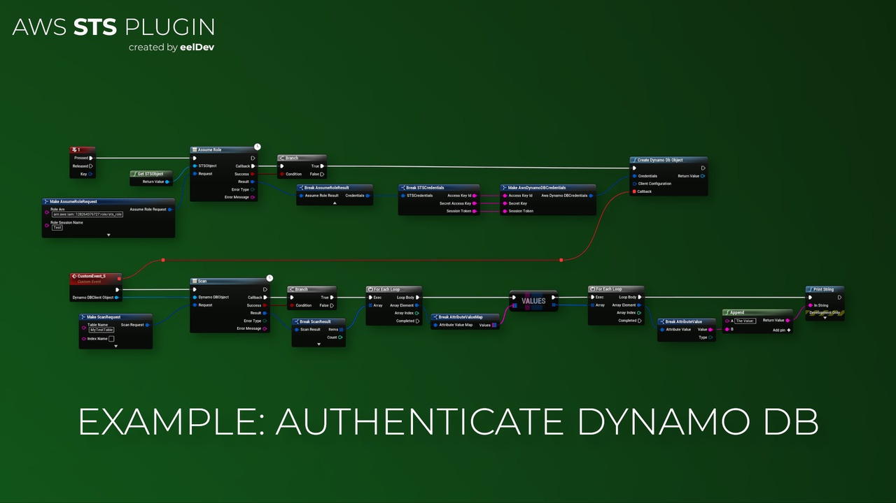

import Tabs from '@theme/Tabs';
import TabItem from '@theme/TabItem';

# Introduction

## Features
- The AWS STS plugin for Unreal Engine allows you to use Amazon Sercure Token Service functionality inside Unreal Engine using the Unreal Engine Blueprints System.
- AWS provides AWS Security Token Service (AWS STS) as a web service that enables you to request temporary, limited-privilege credentials for AWS Identity and Access Management (IAM) users or for users you authenticate (federated users). This guide describes the AWS STS API. For more information, see Temporary Security Credentials in the IAM User Guide.

<Tabs>
  <TabItem value="image" label="Image" default>
    
  </TabItem>
  <TabItem value="image2" label="Image 2">
    
  </TabItem>
</Tabs>

## Purchase
- https://www.fab.com/listings/bb31be94-fc43-4b50-b7bd-e3f75480eb2c

# AWS (Amazon) Documentation
- https://docs.aws.amazon.com/STS/latest/APIReference/welcome.html