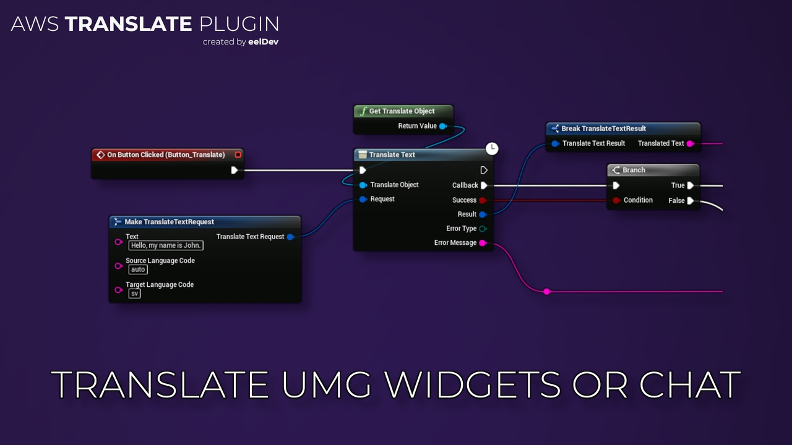
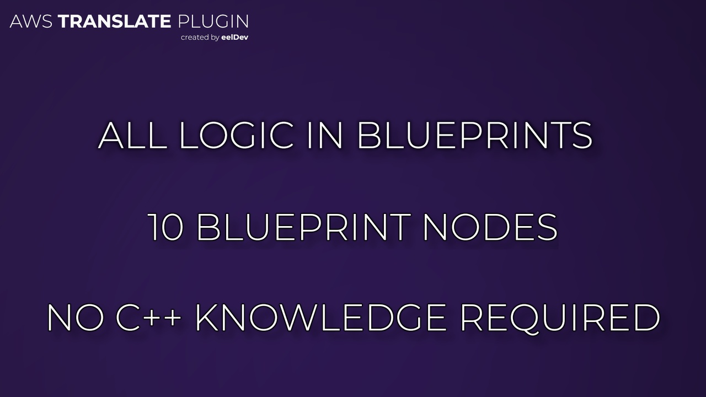
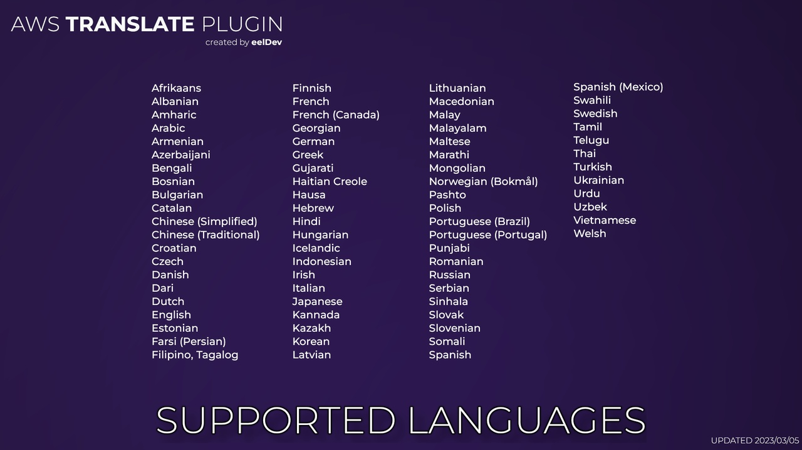

import Tabs from '@theme/Tabs';
import TabItem from '@theme/TabItem';

# Introduction
Amazon Translate is a neural machine translation service that delivers fast, high-quality, and affordable language translation

<Tabs>
  <TabItem value="image" label="Image" default>
    
  </TabItem>
  <TabItem value="image2" label="Image 2">
    
  </TabItem>
  <TabItem value="image3" label="Image 3">
    
  </TabItem>
</Tabs>

## Purchase
- https://www.fab.com/listings/a3c3e2b1-ad1c-4752-90cd-63d2f03acbd1

# AWS (Amazon) Documentation
- https://aws.amazon.com/translate/