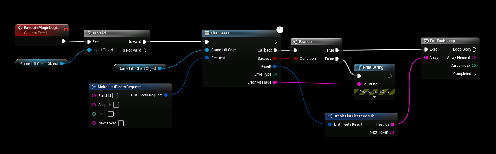

# Using the Plugin
- After [initializing the plugin](./initializing_plugin.md) you can then start using the plugin and the service you are configuring.
- Here is a quick example on how to list all active gamelift fleets using the plugin.

## Blueprint Example

## Using the AWS documentation
- All nodes in all plugins are named the same as in the official AWS documentation, this makes it super simple to follow the official docs and tranferring that to Unreal Engine Blueprint logic.
- You can find a link to the API Documentation for each plugin in the menu to the left.

